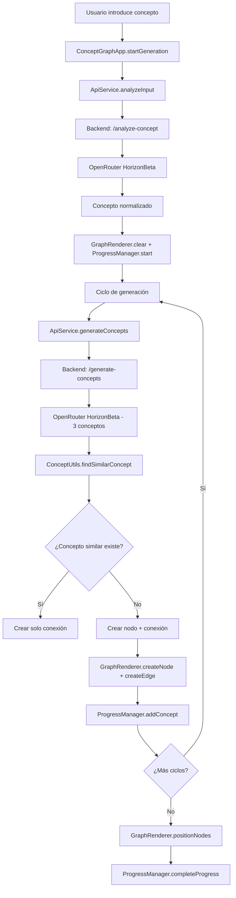
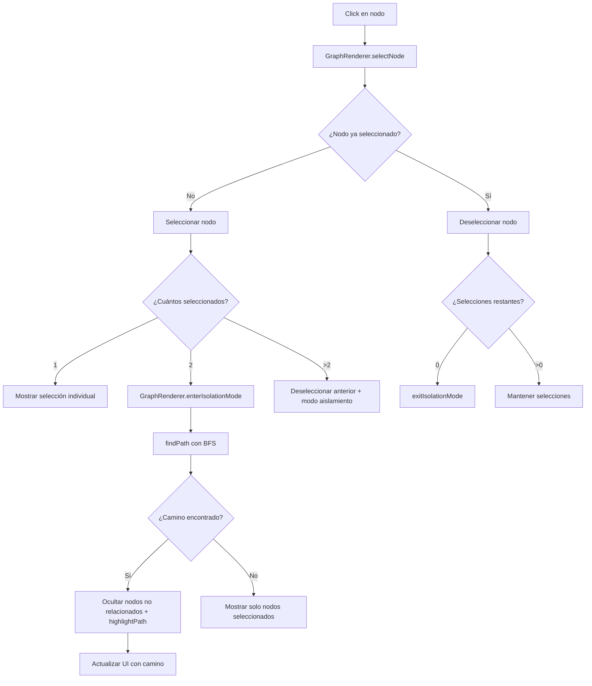

# CreativIA - Documentación Técnica

## 1. Resumen del Proyecto

**CreativIA** es una aplicación web de visualización de grafos de conceptos en 3D que utiliza inteligencia artificial para generar y explorar relaciones conceptuales. La aplicación permite a los usuarios introducir un concepto inicial y generar automáticamente una red de conceptos relacionados visualizada en un entorno 3D interactivo.

### Características principales:
- Visualización 3D interactiva de grafos de conceptos
- Generación automática de conceptos relacionados usando IA
- Sistema de selección de nodos con visualización de caminos
- Interfaz minimalista y elegante
- Análisis inteligente de conceptos vs frases
- Progreso visual en tiempo real

## 2. Arquitectura del Sistema

### 2.1 Estructura General
```
CreativIA/
├── backend/
│   └── main.py              # API FastAPI
├── js/
│   ├── main.js              # Punto de entrada principal
│   ├── modules/
│   │   ├── ConceptGraphApp.js   # Controlador principal
│   │   ├── GraphRenderer.js     # Motor de renderizado 3D
│   │   └── ProgressManager.js   # Gestión de progreso
│   ├── services/
│   │   └── ApiService.js        # Comunicación con API
│   └── utils/
│       └── ConceptUtils.js      # Utilidades de conceptos
├── index.html               # Interfaz principal
└── requirements.txt         # Dependencias Python
```

### 2.2 Patrón de Arquitectura
- **Frontend**: Arquitectura modular ES6 con separación de responsabilidades
- **Backend**: API REST con FastAPI
- **Comunicación**: Asíncrona mediante fetch API
- **Renderizado**: Three.js para visualización 3D
- **Estado**: Gestión local en cada módulo

## 3. Backend - API FastAPI

### 3.1 Configuración Base
```python
# Servidor FastAPI con CORS habilitado
app = FastAPI(title="Concept Graph API")
OPENROUTER_BASE_URL = "https://openrouter.ai/api/v1/chat/completions"
```

### 3.2 Endpoints de la API

#### POST `/analyze-concept`
**Propósito**: Analiza si el texto es un concepto simple o una frase compleja
```python
# Request
{
    "text": "string"
}

# Response
{
    "is_concept": bool,
    "extracted_concept": "string",
    "explanation": "string"
}
```

**Proceso**:
1. Envía prompt a OpenRouter HorizonBeta
2. Analiza respuesta con formato `TIPO|concepto|explicación`
3. Normaliza y limpia el concepto extraído
4. Retorna análisis estructurado

#### POST `/generate-concepts`
**Propósito**: Genera exactamente 3 conceptos relacionados
```python
# Request
{
    "concept": "string",
    "cycles": int (opcional, default: 5)
}

# Response
{
    "related_concepts": ["string", "string", "string"]
}
```

**Proceso**:
1. Construye prompt específico para generar 3 conceptos
2. Llama a OpenRouter HorizonBeta con temperatura 0.5
3. Limpia y normaliza conceptos resultantes
4. Garantiza exactamente 3 conceptos (rellena si es necesario)

#### POST `/add-concept`
**Propósito**: Añade concepto al grafo en memoria
```python
# Parámetros: concept (string), parent (string, opcional)
# Response: {"status": "success", "concept_id": int, "similar_connections": int}
```

**Proceso**:
1. Normaliza concepto entrante
2. Verifica duplicados existentes
3. Crea nodo en estructura del grafo
4. Establece relación padre-hijo si aplica
5. Busca y crea conexiones con conceptos similares

#### GET `/graph`
**Propósito**: Obtiene el grafo completo
```python
# Response
{
    "nodes": [{"id": int, "label": string, "x": float, "y": float, "z": float}],
    "edges": [{"source": int, "target": int}]
}
```

#### DELETE `/reset-graph`
**Propósito**: Reinicia el grafo manteniendo historial de conceptos
```python
# Response: {"status": "Graph reset successfully"}
```

### 3.3 Funciones Auxiliares

#### `call_openrouter_api(messages, max_tokens, temperature)`
- Gestiona comunicación con OpenRouter HorizonBeta
- Configura headers de autenticación y referencia
- Maneja errores de conectividad

#### `clean_concept(concept)`
- Elimina números, viñetas y caracteres especiales
- Normaliza espacios en blanco
- Capitaliza primera letra
- Preserva caracteres en español (áéíóúñ)

#### `calculate_similarity(str1, str2)`
- Implementa algoritmo de distancia Levenshtein
- Calcula similaridad normalizada (0-1)
- Usado para detectar conceptos similares

#### `find_existing_concepts(new_concept, existing_concepts)`
- Busca conceptos existentes relacionados
- Umbral de similaridad del 60%
- Retorna lista de conceptos conectables

### 3.4 Almacenamiento en Memoria
```python
concept_graph = {
    "nodes": {},  # {id: {id, label, x, y, z}}
    "edges": []   # [{source: id, target: id}]
}

all_generated_concepts = set()  # Historial global
```

## 4. Frontend - Módulos JavaScript

### 4.1 ConceptGraphApp.js - Controlador Principal

**Responsabilidades**:
- Coordinación general de la aplicación
- Gestión de ciclos de generación
- Control de estados de UI
- Orquestación de proceso de generación

**Métodos principales**:

#### `constructor()`
- Inicializa módulos (GraphRenderer, ProgressManager, ApiService)
- Configura estado inicial y eventos

#### `startGeneration()`
**Proceso completo de generación**:
1. **Validación**: Verifica input del usuario
2. **Análisis**: Llama a `/analyze-concept` para extraer concepto principal
3. **Inicialización**: Limpia grafo anterior y configura progreso
4. **Generación iterativa**: 
   - Por cada ciclo (2-5 configurables)
   - Para cada concepto actual, genera 3 relacionados
   - Verifica similaridad con existentes
   - Crea nodos y conexiones visuales
5. **Finalización**: Posiciona nodos y completa progreso

#### `adjustCycles(delta)`
- Controla contador de ciclos (rango 2-5)
- Actualiza UI y habilita/deshabilita botones

#### `showGeneratingState(concept)` / `hideGeneratingState()`
- Transforma interfaz durante generación
- Input → Título, botón play → pause
- Deshabilita controles durante proceso

### 4.2 GraphRenderer.js - Motor de Visualización 3D

**Responsabilidades**:
- Renderizado Three.js del grafo 3D
- Gestión de interacciones de usuario
- Sistema de selección de nodos
- Algoritmos de posicionamiento

**Configuración Three.js**:
```javascript
scene = new THREE.Scene()
camera = new THREE.PerspectiveCamera(75, aspect, 0.1, 1000)
renderer = new THREE.WebGLRenderer({ antialias: true })
controls = new OrbitControls(camera, renderer.domElement)
```

**Iluminación**:
- AmbientLight: Iluminación general (0x404040, 0.4)
- DirectionalLight: Luz principal con sombras (0xffffff, 0.8)
- PointLight: Luz de acento azul (0x00aaff, 0.3)

#### `createNode(concept, position, animated)`
**Proceso de creación de nodo**:
1. Genera color basado en hash del concepto
2. Crea esfera 3D con material Phong
3. Añade efecto de brillo (glow)
4. Genera etiqueta de texto en canvas
5. Configura interactividad (userData)
6. Anima aparición si es solicitado

#### `createEdge(fromConcept, toConcept, animated)`
**Proceso de creación de conexión**:
1. Calcula curva Bézier cuadrática entre nodos
2. Genera geometría de línea con 50 puntos
3. Aplica color promedio de nodos conectados
4. Anima aparición gradual

#### `positionNodes()`
**Algoritmo de fuerza dirigida**:
1. **Repulsión**: Fuerza de separación entre todos los nodos
2. **Atracción**: Fuerza de acercamiento entre nodos conectados
3. **Simulación**: 150 iteraciones de física
4. **Amortiguación**: Factor 0.85 para estabilización
5. **Animación**: Transición suave a posiciones calculadas

#### Sistema de Selección de Nodos

#### `selectNode(concept)`
**Lógica de selección**:
- 0 nodos: Estado normal
- 1 nodo: Muestra selección individual
- 2 nodos: Activa modo aislamiento con búsqueda de camino
- >2 nodos: Mantiene solo los 2 más recientes

#### `findPath(startConcept, endConcept)`
**Búsqueda de camino más corto (BFS)**:
1. Construye lista de adyacencia bidireccional
2. Implementa búsqueda en anchura
3. Retorna camino completo o null si no existe

#### `enterIsolationMode()` / `exitIsolationMode()`
**Modo aislamiento**:
- Oculta nodos y aristas no relacionados con el camino
- Resalta nodos del camino (INICIO, PASOS, FIN)
- Actualiza UI con información del camino

### 4.3 ProgressManager.js - Gestión de Progreso

**Responsabilidades**:
- Cálculo de progreso basado en fórmula 3^n
- Visualización de conceptos generados en tiempo real
- Control de overlay de progreso

#### `calculateMaxNodes(cycles)`
```javascript
// Fórmula: 1 + 3^1 + 3^2 + ... + 3^n
let total = 1; // Concepto inicial
for (let i = 0; i < cycles; i++) {
    total += Math.pow(3, i + 1);
}
```

#### `addConcept(concept)`
- Incrementa contador de nodos
- Añade concepto a lista generada
- Actualiza UI con animación de aparición
- Recalcula barra de progreso

#### `addConceptToUI(concept)`
- Crea elemento visual para concepto
- Aplica animación CSS de aparición
- Gestiona scroll automático

### 4.4 ApiService.js - Comunicación con Backend

**Responsabilidades**:
- Abstrae llamadas HTTP al backend
- Manejo de errores y timeouts
- Transformación de datos

#### Métodos principales:
```javascript
analyzeInput(text)           // POST /analyze-concept
generateConcepts(concept)    // POST /generate-concepts  
addConceptToGraph(concept, parent) // POST /add-concept
resetGraphData()            // DELETE /reset-graph
```

**Manejo de errores**:
- Try-catch en todas las llamadas
- Logging de errores en consola
- Valores de retorno seguros (null, [])

### 4.5 ConceptUtils.js - Utilidades

**Funciones utilitarias**:

#### `cleanConcept(concept)`
- Limpieza de texto idéntica al backend
- Preserva caracteres especiales del español
- Normalización de formato

#### `calculateSimilarity(str1, str2)`
- Distancia Levenshtein implementada en frontend
- Normalización a escala 0-1
- Usado para deduplicación local

#### `findSimilarConcept(newConcept, existingConcepts, threshold=0.8)`
- Búsqueda de concepto más similar
- Umbral configurable de similaridad
- Retorna mejor coincidencia o null

#### `getConceptHue(concept)`
- Genera color consistente basado en hash
- Garantiza mismo color para mismo concepto
- Distribución uniforme en espacio HSL

## 5. Flujo de Datos y Procesos

### 5.1 Proceso de Generación Completo



### 5.2 Sistema de Selección de Nodos



### 5.3 Comunicación Frontend-Backend

**Patrón de comunicación**:
1. **Frontend** realiza llamada asíncrona
2. **ApiService** abstrae HTTP request
3. **Backend** procesa y llama a IA si necesario
4. **Respuesta** se propaga de vuelta
5. **UI** se actualiza según resultado

**Gestión de estado**:
- Backend: Estado del grafo en memoria
- Frontend: Estado visual en Three.js scene
- Sincronización: Via llamadas API explícitas

## 6. Tecnologías y Dependencias

### 6.1 Backend
```python
fastapi==0.104.1      # Framework web asíncrono
uvicorn==0.24.0       # Servidor ASGI
pydantic==2.5.0       # Validación de datos
requests==2.31.0      # Cliente HTTP
python-dotenv==1.0.0  # Variables de entorno
```

### 6.2 Frontend
```javascript
three@0.158.0                    # Biblioteca 3D
three/addons/controls/OrbitControls.js  # Controles de cámara
```

### 6.3 Servicios Externos
- **OpenRouter HorizonBeta**: Modelo de IA para generación de conceptos
- **Google Fonts**: Fuente Inter para UI

## 7. Configuración y Despliegue

### 7.1 Variables de Entorno
```bash
OPENROUTER_API_KEY=sk-or-...  # Clave API de OpenRouter
```

### 7.2 Instalación
```bash
# Backend
pip install -r requirements.txt

# Frontend (desarrollo)
npm install vite --save-dev

# Ejecución
python backend/main.py        # Puerto 8000
npx vite                      # Puerto 3000 (desarrollo)
```

### 7.3 Configuración CORS
```python
allow_origins=["*"]           # Permitir todos los orígenes
allow_credentials=True        # Permitir credenciales
allow_methods=["*"]          # Permitir todos los métodos
allow_headers=["*"]          # Permitir todos los headers
```

## 8. Características Técnicas Destacadas

### 8.1 Optimizaciones de Rendimiento
- **Animaciones CSS**: Transiciones suaves con `cubic-bezier`
- **Three.js**: Geometrías optimizadas (32 segmentos para esferas)
- **Debouncing**: Limitación de llamadas durante generación
- **Memoria**: Limpieza explícita de objetos Three.js

### 8.2 Experiencia de Usuario
- **Glassmorphism**: Efectos de vidrio con `backdrop-filter`
- **Responsive**: Diseño adaptativo para móviles
- **Accessibility**: Atajos de teclado (ESC para limpiar)
- **Feedback visual**: Estados de loading y progreso

### 8.3 Robustez del Sistema
- **Fallbacks**: Valores por defecto en caso de error de IA
- **Validación**: Limpieza y normalización en frontend y backend
- **Error handling**: Manejo graceful de errores de red
- **Deduplicación**: Prevención de conceptos duplicados

### 8.4 Algoritmos Implementados
- **Levenshtein**: Cálculo de similaridad textual
- **BFS**: Búsqueda de camino más corto en grafo
- **Force-directed**: Algoritmo de posicionamiento físico
- **Hash coloring**: Colores consistentes basados en contenido

## 9. Limitaciones y Consideraciones

### 9.1 Limitaciones Técnicas
- **Almacenamiento**: Estado del grafo en memoria (no persistente)
- **Escalabilidad**: Limitado por complejidad O(n²) del algoritmo de fuerzas
- **Concurrencia**: Sin soporte para múltiples usuarios simultáneos
- **Ciclos**: Máximo 5 ciclos por limitaciones de rendimiento

### 9.2 Dependencias Externas
- **OpenRouter**: Disponibilidad del servicio de IA
- **Conectividad**: Requiere conexión a internet
- **Browser support**: Requiere soporte para ES6 y WebGL

### 9.3 Seguridad
- **CORS abierto**: Configurado para desarrollo (*permitir todos*)
- **API Key**: Almacenada en servidor (buenas prácticas)
- **Input validation**: Sanitización en frontend y backend

## 10. Futuras Mejoras Sugeridas

### 10.1 Funcionalidades
- Persistencia de grafos en base de datos
- Exportación de grafos (JSON, SVG, PNG)
- Modo colaborativo multi-usuario
- Filtros y búsqueda de conceptos
- Historial de sesiones

### 10.2 Optimizaciones
- Implementación de Web Workers para cálculos pesados
- Cache inteligente de llamadas a IA
- Lazy loading de nodos en grafos grandes
- Algoritmos de clustering para visualización

### 10.3 UX/UI
- Modo oscuro/claro
- Personalización de colores y temas
- Tutorial interactivo
- Atajos de teclado avanzados
- Zoom y navegación mejorados